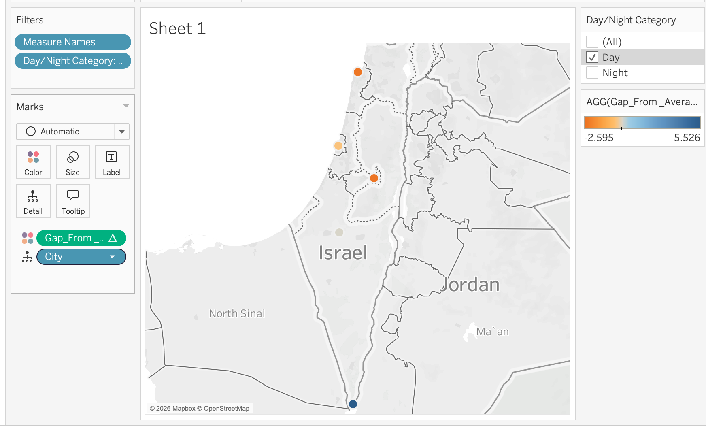

# 🌦️ Automated Weather ETL Pipeline & Dynamic SQL Analytics

A production ready Python and SQL data engineering project that extracts real time meteorological data from the OpenWeatherMap API, normalizes it, and loads it into a local SQLite relational database. It includes an automated orchestrator alongside a complex analytical reporting script designed to detect temperature anomalies based on historical day/night baselines.

🎯 Why I Built This? (The Business Case)

* **The Problem:** Companies lose money when they are surprised by extreme weather shifts , or when employees waste time copying data manually from websites every hour.
* **The Solution:** I built an automated system that does all the heavy lifting. It collects live data every hour, stores it safely, and instantly flags whether a city is currently hotter or colder than its usual historical average. This helps managers make smart, data driven decisions to save operational costs.

---

## 📊 Data Visualization & Insights
Beyond the textual analytics, I developed an interactive Tableau dashboard to visualize the data in real-time.

What it shows: The map highlights temperature deviations across various cities in Israel relative to their historical baselines.

Business Value: Users can filter data by Day/Night Category to analyze how weather patterns shift throughout the day.

Trend Identification: The color-coded mapping helps stakeholders immediately identify cities experiencing extreme weather anomalies.

Dashboard:

---

## 🚀 Key Features & Architecture

* **Automated ETL Pipeline (`extract_data.py`):** Programmatically fetches current weather payloads for major metropolitan areas in Israel every hour.
* **Lightweight, Dependency-Free Extraction:** Built using Python's native ecosystem (`sqlite3`, `json`, `datetime`) to guarantee optimal performance, zero compilation bottlenecks, and a 100% runtime success rate on any OS.
* **Advanced Analytical SQL (`weather_analytics.py`):** Executes a complex self-joining query with dynamic conditional aggregations (`strftime`) to segment historical averages by `Day` (06:00–18:00) vs. `Night` shifts and rank temperature anomalies (`Deviation`) in real time.
* **Industry Standard Security:** Employs zero-hardcoding security policies by securely retrieving API keys directly from system environment variables (`os.environ`).

---

## 🛠️ Tech Stack

* **Language:** Python 3.12+
* **Database:** SQLite3 (Relational Database Management System)
* **APIs & Networking:** Requests (HTTP Library)
* **Version Control:** Git & GitHub (with strict `.gitignore` patterns for local caching and database segregation)

---

## 📊 Sample Analytical Output

When running the analytics script, the engine dynamically calculates baseline deviations and generates a structured report in the terminal:

```text
=======================================================
          📊 WEATHER SUMMARY & ANOMALY REPORT     
=======================================================
City            | Current Temp | Avg Temp   | Deviation
-------------------------------------------------------
Tel Aviv        | 28.99        | 26.5       |      +2.49
Eilat           | 32.14        | 31.0       |      +1.14
Haifa           | 28.43        | 28.43      |       +0.0
Jerusalem       | 25.4         | 26.1       |       -0.7
Beersheba       | 29.07        | 30.5       |      -1.43
=======================================================


How to Run Locally
1. Prerequisites & Environment Setup
Clone the repository and ensure you have an active API key from OpenWeatherMap.

2. Set the Environment Variable
Inject your secret API key safely into your terminal environment (Mac/Linux):
export OPENWEATHER_API_KEY="your_actual_api_key_here"

3. Execute the Pipeline
Run the data extractor to populate the database:
python3 extract_data.py

4. Generate the Analytics Report
Open a parallel terminal window and execute the analyzer:
python3 weather_analytics.py
